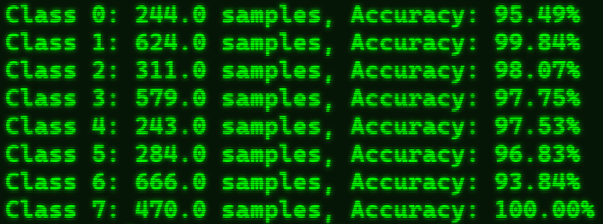

# Medical Unlearning

Toward machine fairness in the field of medicine. 

This project aims to verify unlearning methods can be applied to models trained for medical image classification tasks.

Torch with CUDA is required for this project.

## Examine Data

We consider several medical datasets from MedMNIST (https://medmnist.com/) shown in the table bellow:


Lets have a look at the BloodMNIST dataset. To examine a dataset use the following command line:


```bash
python examine_dataset.py --dataset {dataset_name}
```

Here is the command for BloodMNIST:

```bash
python examine_dataset.py --dataset BloodMNIST
```

This script will tell you how much of each class exists in the dataset, as well as the dataset split, and a grid of the data samples (with the associated class):


## Train Model

To train a model on one of these datasets we use the following command line:

```bash
python main_train.py  --save_model_id {name}  --dataset {dataset_name}
```

The save_model_id is a unique identifier for the trained model and can be any string. More arguments can be specified here, such as epochs, learning rate, and random seed, all available arguments can be seen in the arg_parser.py script. Bellow is an example:

```bash
python main_train.py  --save_model_id {name}  --dataset {dataset_name}  --seed {seed_number} --epochs {epochs} --lr {learning_rate} --batch_size {batch_size}
```

For example, we will run the following command:

```bash
python main_train.py  --save_model_id example_blood_model  --dataset BloodMNIST  --seed 1 --epochs 50 --lr 0.01 --batch_size 50
```

The script will save both the last and best checkpoints to the directory:
**model_weights/{name}_best.pt** or **model_weights/{name}_last.pt**

## Test Model

Lets quickly test the performance of this model using the following command line:

```bash
python main_test.py --model_id {name} --dataset {dataset_name}
```

Here is the full command line we will use (remember the _best or _last for model_id), also be mindful that batch_size and num_workers are optimal for your computer:

```bash
python main_test.py --model_id example_blood_model_best  --dataset BloodMNIST  --batch_size 50  --num_workers 0
```


Bellow is the output:


Using the number keys, you can sample data from specific classes, the script will also output the class wise performance of the model to the terminal:



# Create Unlearned Model
## Generate Mask

First we must create the saliency map for the base model, in our case, the base model we will use is __example_blood_model_best__

To create the saliency map, simply run this command:

```bash
python generate_mask.py --model_id {model_name} --dataset {dataset_name}
```

So our command will be:

```bash
python generate_mask.py --model_id example_blood_model_best --dataset BloodMNIST
```

This will create a directory in SaliencyMaps/{model_name}/ which will contain all the masks, different threshholds will result in different performance, so some work should be done to decide which mask is the most effective. For the purpose of this notebook, lets just use threshhold 0.5

## Forget Class

Lets attempt to forget class 3. To do this, simply use the following command line:

```bash
python main_unlearn.py --model_id {model_name} --dataset {dataset_name}   --unlearn {unlearn_method_id}  --class_to_forget {class_number}  --mask_thresh {threshhold}
```

You can specify more paramentres:

```bash
python main_unlearn.py --model_id {model_name} --dataset {dataset_name}   --unlearn {unlearn_method_id}  --class_to_forget {class_number}  --mask_thresh {threshhold} --unlearn_epochs {epochs}    --unlearn_lr {learning_rate}  --unlearn_batch_size {batch_size}
```

Bellow is a table of unlearning techniques and the associated unlearn_method_id:


Note that different techniques will require different ideal values for learing rate and epochs etc, therefore some testing is required to find the ideal parametres.

Bellow is the full command line we will use to create an unlearned model from our base model __example_blood_model_best__ that has forgotten class 3, lets use *Random Labelling with SalUn*:

```bash
python main_unlearn.py --model_id example_blood_model_best --dataset BloodMNIST   --unlearn RL_with_SalUn     --class_to_forget 3 --mask_thresh 0.5 --unlearn_epochs 5    --unlearn_lr 0.001  --unlearn_batch_size 100
```

Note some unlearning methods don't need a mask threshhold, so it will ignore the --mask_thresh argument.
This will create a model that will have the unique ID:

__example_blood_model_best_FORGOTTEN_3_RL_WITH_SALUN_mask5_unlearnEpochs5_unlearnlr001__

## Test and Compare Unlearned Model

To check how well our unlearned model has done, we can run the following command line:

```bash
python main_test_unlearn.py  --model_id {model_name}  --dataset {dataset_name}  --class_to_forget {class_number}  --batch_size {batch_size}
```

In our case, we will run the following command:

```bash
python main_test_unlearn.py  --model_id example_blood_model_best_FORGOTTEN_3_RL_WITH_SALUN_mask5_unlearnEpochs5_unlearnlr001  --dataset BloodMNIST  --class_to_forget 3  --batch_size 100
```

This will create a dataset without the class 3, and test how well the model does on it. The script also creates a dataset only containing class 3 to check how well we have forgotten. The three criterea we are concerned about are:

- __Unlearn Accuracy__ (How well we have forgotten)
- __Remaining Accuracy__ (How well the model performs on data it has seen before) 
- __Test Accuracy__ (How well the model performs on data it hasn't seen before)


Unlearn accuracy is not amazing, but this is without parametre optimisation, so lets continue. We can also run this script on the base model, to get an idea of how the original model performs on the forgotten dataset:

```bash
python main_test_unlearn.py     --model_id example_blood_model_best  --dataset BloodMNIST  --class_to_forget 3 --batch_size 100
```


Great, so we have partially forgotten class 3, and our model accuracy has not degraded. To examine the model's performance, we can run the main_test.py script again for our unlearned model:

```bash
python main_test.py --model_id example_blood_model_best_FORGOTTEN_3_RL_WITH_SALUN_mask5_unlearnEpochs5_unlearnlr001    --dataset BloodMNIST    --batch_size 50 --num_workers 0
```


Lets have a look at class 3:


